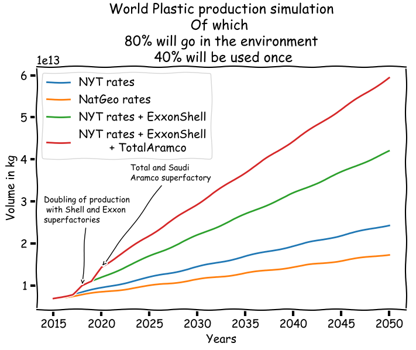

# MarinePlasticTools
A set of tools to visualise and analyse data collected by [Plastic@Bay](https://www.plasticatbay.org)

## Basic setup

```
# Python 2
pip install -r requirements.py
```

## Display Plot charts

#### 20 year simulation of plastic accumulation at Canna Nam Buch
```
python Plasticaccumulation_rates.py
```
<p align="left">
  
</p>


#### Comparisons of plastic accumulation with and without beach-cleaning efforts
```
python SimNW.py
```

<p align="left">
  
</p>

#### World Plastic production simulation
```
python Volumes.py
```

<p align="left">
  
</p>

